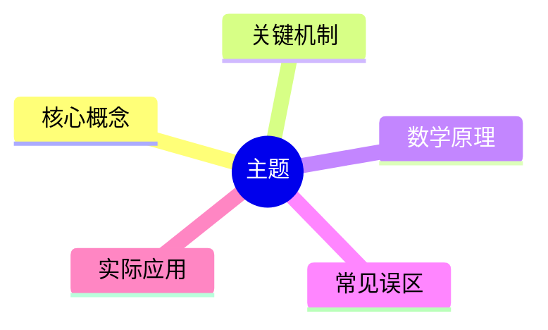
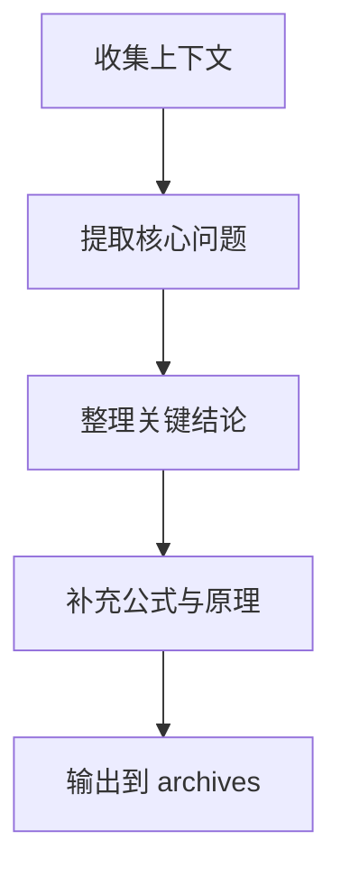

# archive 技能

## 技能目标

对当前上下文中的学习内容、讨论过程、关键结论与待解决问题进行整理归档，提炼为结构化的 Markdown 文档，并输出到 `archives` 文件夹中，便于后续复习、扩展与引用。

## 适用场景

当出现以下情况时，应优先考虑调用本技能：

- 当前上下文已经积累了较多对话、分析、推导或结论。
- 用户希望把本轮学习内容沉淀为可复用的学习文档。
- 用户希望将零散讨论整理为笔记、总结、提纲或知识卡片。
- 一轮学习结束后，需要对重点内容进行归档。
- 已有历史归档文件，需要在原有基础上继续补充和修订。

## 输入要求

本技能可接收但不限于以下输入：

- 当前上下文中的全部对话内容。
- 用户显式指定的主题、标题或文件名。
- 用户提供的目标文件路径。
- 已存在的归档文档路径。
- 用户特别强调的重点，例如数学推导、关键结论、易错点、对比关系等。

## 输出规则

1. 默认将文档输出到 `archives` 文件夹中。
2. 如果用户指定了文件名，则优先使用用户指定的文件名。
3. 如果用户指定了完整文件路径，则优先输出到对应路径。
4. 如果用户指定或提供的文件路径已经存在，则不要覆盖式重写，而是在原有 Markdown 文件基础上继续补充、修订和合并内容。
5. 如果用户没有指定文件名，可根据主题自动生成清晰、可读、可检索的文件名。

## 文档组织要求

归档后的 Markdown 文档应尽量包含以下内容：

- 主题标题
- 背景与学习目标
- 核心概念总结
- 关键机制拆解
- 数学原理与公式说明
- 重要结论
- 关键例子
- 容易混淆或易错点
- 待继续探索的问题
- 后续学习建议

如果上下文允许，也可以加入以下结构化内容：

- 思维导图（Mind Map）
- 流程图（Flowchart）
- 时序图（Sequence Diagram）
- 对比表
- 分层提纲

## 图示要求

如有必要，可在 Markdown 中使用 Mermaid 图表（Mermaid）表达结构关系。例如：

## 工作流程

1. 收集当前上下文中的所有有效信息。
2. 识别主题、核心问题、关键结论和重要分支。
3. 提炼对学习最有价值的内容，而不是简单照搬原始对话。
4. 按“概念 -> 机制 -> 数学 -> 例子 -> 问题”的顺序重组内容。
5. 如果发现已有归档文件，则先读取原文，再做增量补充与结构优化。
6. 输出结构化 Markdown 文档到 `archives` 或用户指定位置。

## 内容风格要求

- 全文使用中文。
- 重要术语首次出现时，采用“中文（English, Abbreviation）”形式。
- 优先保留真正有学习价值的内容，避免机械堆砌对话原文。
- 对底层原理和数学机制保持较高关注度。
- 对可以图示化的内容，优先使用流程图、思维导图或对比表提升可读性。

## 合并与补充策略

当目标文件已经存在时，应遵循以下策略：

- 保留原有结构中仍然有效的部分。
- 补充新结论、新例子、新推导和新的待研究问题。
- 删除明显重复、冲突或质量较低的表述。
- 在不破坏原意的前提下优化章节结构与语言清晰度。
- 让新旧内容融合成一份更完整的学习文档，而不是简单追加流水账。

## 示例

### 示例一：用户未指定文件名

输入意图：

“帮我把这轮关于 Transformer 的讨论整理归档。”

输出行为：

- 自动生成类似 `archives/transformer-学习归档.md` 的文件。
- 在文档中整理概念、注意力机制（Attention Mechanism）、训练目标、关键公式、常见误区和后续问题。

### 示例二：用户指定文件名

输入意图：

“把这次关于强化学习的内容归档到 `rl-week1.md`。”

输出行为：

- 输出到 `archives/rl-week1.md`。

### 示例三：用户提供已有路径

输入意图：

“请继续补充 `archives/embodied-intelligence.md`。”

输出行为：

- 先读取已有文件。
- 在原文基础上补充具身智能（Embodied Intelligence）的新讨论内容，而不是另起新文件。