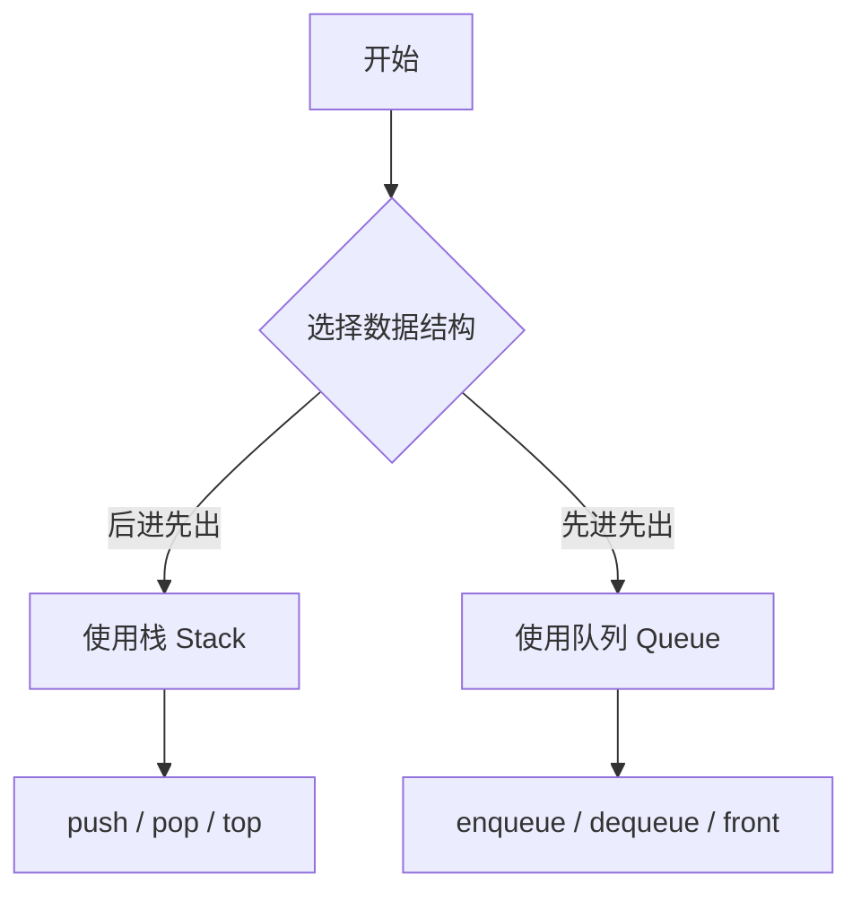
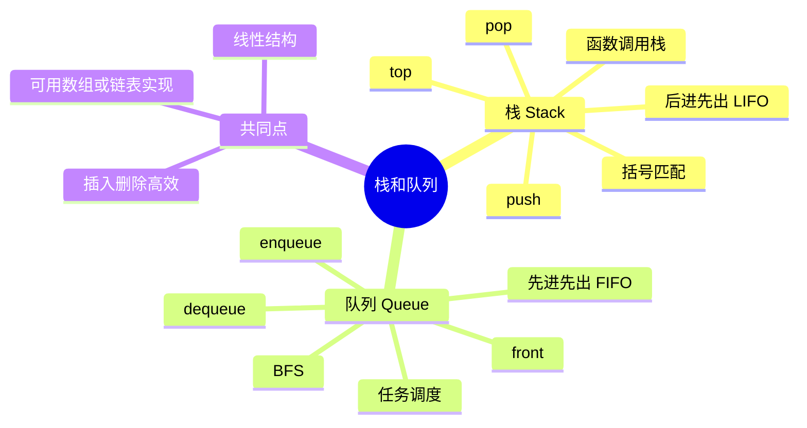

# 栈和队列学习归档

## 基本信息

- 主题：数据结构中的栈（Stack）与队列（Queue）
- 类型：学习归档示例
- 学习目标：理解两种线性数据结构的定义、操作规则、时间复杂度、典型应用与常见误区

## 本次学习想回答什么问题

1. 栈和队列分别是什么？
2. 它们的核心操作规则为什么不同？
3. 这种规则会如何影响实际使用场景？
4. 它们的底层实现可以有哪些方式？
5. 为什么很多算法题、系统设计和工程代码里都会频繁出现这两种结构？

## 一句话总结

- 栈是后进先出（Last In First Out, LIFO）的线性结构。
- 队列是先进先出（First In First Out, FIFO）的线性结构。
- 它们的区别不在“存储长什么样”，而在“元素被访问和移除的顺序规则”。

## 核心概念

### 栈是什么

栈（Stack）可以理解成一摞盘子。新盘子总是放在最上面，拿盘子时也总是先拿最上面的那个。因此，最后放进去的元素，往往最先被取出来。

典型操作：

- 入栈（push）：把元素放到栈顶
- 出栈（pop）：移除并返回栈顶元素
- 取栈顶（peek / top）：查看栈顶元素但不移除
- 判空（isEmpty）：判断栈是否为空

### 队列是什么

队列（Queue）可以理解成排队。新来的人排到队尾，而最先被服务的是队头的人。因此，最早进入队列的元素会最先被取出。

典型操作：

- 入队（enqueue）：把元素加入队尾
- 出队（dequeue）：移除并返回队头元素
- 查看队头（front / peek）：查看队头元素但不移除
- 判空（isEmpty）：判断队列是否为空

## 为什么会有这两种结构

从本质上看，栈和队列都在回答同一个问题：

“当一批元素按照某种顺序到来时，我们希望按照什么规则把它们取出来？”

这里其实反映的是一种约束设计：

- 如果你希望最新状态优先被处理，就更接近栈
- 如果你希望按照到达顺序公平处理，就更接近队列

也就是说，栈和队列不是为了“多一种存储方式”，而是为了表达不同的处理顺序约束。

## 对比理解

| 维度 | 栈（Stack） | 队列（Queue） |
| --- | --- | --- |
| 顺序规则 | 后进先出（LIFO） | 先进先出（FIFO） |
| 主要操作位置 | 栈顶 | 队头和队尾 |
| 插入位置 | 栈顶 | 队尾 |
| 删除位置 | 栈顶 | 队头 |
| 直觉类比 | 盘子堆 | 排队 |
| 典型应用 | 函数调用、括号匹配、撤销操作 | 任务调度、消息缓冲、广度优先搜索 |

## 操作流程图

## 思维导图

## 底层实现方式

### 栈的实现

栈通常可以用以下方式实现：

- 数组（Array）
- 链表（Linked List）

如果使用数组实现：

- 栈顶通常对应数组尾部
- `push` 通常是在尾部追加元素
- `pop` 通常是在尾部删除元素

如果使用链表实现：

- 常把链表头作为栈顶
- 这样插入和删除都能保持在常数时间内完成

### 队列的实现

队列也可以用数组或链表实现，但需要注意一个问题：

如果直接用普通数组，并且每次出队都把最前面的元素删除，那么后面的元素可能要整体前移，时间复杂度会变高。

因此更常见的做法有：

- 用链表维护队头和队尾
- 用循环队列（Circular Queue）避免频繁搬移数据

## 时间复杂度

在合理实现下，栈和队列的核心操作通常都可以达到 `O(1)`。

| 操作 | 栈 | 队列 |
| --- | --- | --- |
| 插入 | `O(1)` | `O(1)` |
| 删除 | `O(1)` | `O(1)` |
| 查看头部或栈顶 | `O(1)` | `O(1)` |

这里要特别注意一个细节：

时间复杂度不是由“名字”决定的，而是由“具体实现”决定的。比如：

- 用动态数组实现栈时，均摊意义下 `push` 常常是 `O(1)`
- 用不合适的数组删除策略实现队列时，`dequeue` 可能退化成 `O(n)`

## 典型应用场景

### 栈的典型应用

1. 函数调用栈（Call Stack）
   每调用一个函数，就把当前执行上下文压入栈中；函数返回时，再从栈顶弹出。

2. 括号匹配
   遇到左括号就入栈，遇到右括号就检查栈顶是否匹配。

3. 撤销操作（Undo）
   最新的一次操作通常最先被撤销，这天然符合后进先出。

4. 深度优先搜索（Depth-First Search, DFS）
   递归本质上就隐含使用了系统栈。

### 队列的典型应用

1. 任务排队
   先到的任务先处理，符合公平原则。

2. 消息缓冲
   生产者产生消息，消费者按顺序消费消息。

3. 广度优先搜索（Breadth-First Search, BFS）
   需要按层次逐步扩展节点，因此天然适合先进先出。

4. 操作系统调度中的等待队列
   进程、请求、任务往往都需要排队等待服务。

## 一个更深的问题

为什么栈常和“递归”联系在一起，而队列常和“层序遍历”联系在一起？

可以从处理顺序来理解：

- 递归会优先进入最新展开的那一层调用，因此更像后进先出
- 层序遍历需要先处理当前层所有节点，再进入下一层，因此更像先进先出

这说明数据结构和算法之间并不是随便搭配的，而是“处理顺序需求”决定了数据结构的选择。

## 常见误区

### 误区一：栈和队列只是定义题，不重要

实际上，很多复杂算法都建立在这两种最基本的顺序约束之上。它们虽然简单，但非常基础。

### 误区二：队列一定比栈更复杂

不一定。它们都很基础，复杂度通常取决于实现方式和应用场景。

### 误区三：只要用了数组，就是顺序表，和栈队列无关

不对。数组只是底层存储结构，栈和队列强调的是“访问规则”。同一个数组可以被组织成不同抽象数据类型。

### 误区四：时间复杂度永远固定

不对。复杂度需要结合实现细节来讨论，不能只看概念名称。

## 一个简化例子

### 栈的例子

依次将 `1, 2, 3` 压入栈：

- push(1)
- push(2)
- push(3)

此时如果连续弹出：

- pop() -> 3
- pop() -> 2
- pop() -> 1

这体现了后进先出。

### 队列的例子

依次将 `1, 2, 3` 加入队列：

- enqueue(1)
- enqueue(2)
- enqueue(3)

此时如果连续出队：

- dequeue() -> 1
- dequeue() -> 2
- dequeue() -> 3

这体现了先进先出。

## 学习中的关键追问

为了真正理解栈和队列，可以继续问自己以下问题：

1. 为什么函数调用天然适合用栈，而不是队列？
2. 为什么广度优先搜索天然适合用队列，而不是栈？
3. 如果用两个栈来实现一个队列，背后的思想是什么？
4. 如果用两个队列来实现一个栈，为什么也能做到？
5. 数据结构的本质，是存储形式，还是访问约束？

## 后续学习建议

- 继续学习双端队列（Deque, Double-Ended Queue）
- 继续学习优先队列（Priority Queue）
- 尝试实现数组栈、链表栈、循环队列
- 结合 DFS 和 BFS 进一步理解“顺序规则如何影响搜索过程”
- 思考抽象数据类型（Abstract Data Type, ADT）与底层存储结构之间的区别

## 本次归档结论

- 栈和队列都是非常基础的线性数据结构。
- 它们最核心的区别在于元素移除顺序不同。
- 栈强调后进先出，队列强调先进先出。
- 真正决定使用哪种结构的，不是习惯，而是问题对“处理顺序”的要求。
- 想真正掌握它们，不能只记定义，还要理解它们为什么适合某些算法和系统场景。
