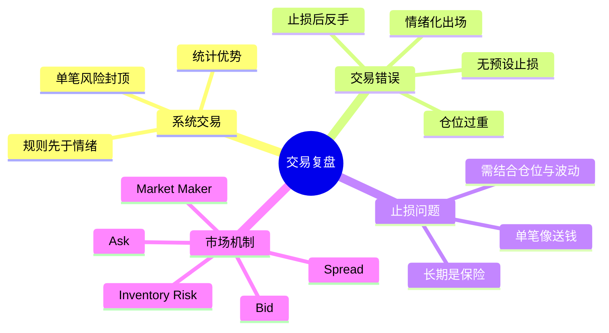

# 海龟交易法则：交易复盘与市场机制归档

## 背景与学习目标

本轮讨论围绕一次真实交易挫折展开：用户在高波动合约中先做多、后割肉、再反手做空，最终在价格回到起点附近时承受了显著亏损。由此延伸出几个关键学习目标：

- 如何从系统交易（Systematic Trading）的视角复盘一次错误操作。
- 如何理解海龟交易法则（Turtle Trading Rules）强调的核心思想，而不是只记住表面规则。
- 如何正确理解止损（Stop Loss）、仓位管理（Position Sizing）与市场波动（Volatility）之间的关系。
- 如何理解买卖价差（Bid-Ask Spread）与做市商（Market Maker）的盈利机制。

这份归档的重点不是评价某一笔交易“对”或“错”，而是提炼出可复用的理解框架，帮助后续建立更稳健的量化交易程序与执行纪律。

## 核心问题总览

本轮讨论可以压缩为四个核心问题：

1. 为什么一笔本来最终可能回本的交易，会因为盘中操作反而亏损扩大？
2. 如果价格后面涨回去了，止损是不是等于“送钱”？
3. 海龟交易法则真正想解决的是什么问题？
4. 做市商为什么能通过买卖价差赚钱？

## 真实交易案例拆解

### 交易经过

- 做多开仓价：`0.7`
- 价格在短时间内快速下跌，最低到达：`0.45`
- 在 `0.58` 附近割掉多单
- 随后顺势做空，并在 `0.52` 附近平空
- 数小时后价格重新回到：`0.7`

### 表面现象

从事后路径看，会很容易得出一个强烈结论：

- 如果当时不看手机、不操作，最终几乎不亏。
- 一操作反而亏了几百美元。

### 更深层的问题

从系统视角看，真正的问题不一定是方向判断本身，而是以下几项：

- 没有在开仓前定义失效条件（Invalidation Condition）。
- 在同一段强烈情绪波动中连续做出多个决策。
- 第一笔交易的止损不是规则执行，而更像情绪投降。
- 第二笔反手做空并非独立策略，更像是在试图修复第一笔亏损带来的心理痛感。

### 关键结论

这次亏损更像是：

- 不是“市场连续打了两次脸”，
- 而是“在高波动里，自己的两次即时反应各造成了一次损失”。

换句话说，亏的主要不是方向，而是流程。

## 海龟交易法则想解决什么

海龟交易法则（Turtle Trading Rules）不是一套“精准预测价格”的方法，而是一套“在不确定市场中可重复执行的规则系统”。

它真正关心的不是：

- 这次一定会不会涨；
- 这次一定会不会跌。

而是：

- 什么时候进场；
- 如果判断错了，什么时候退出；
- 单笔错误最多允许亏多少；
- 如何让一套规则在足够多笔交易中保有统计优势。

## 用海龟视角重看这次交易

### 1. 开仓前未定义退出条件

如果在 `0.7` 做多时，没有提前写出：

- 哪个价格意味着做多逻辑失效；
- 最大允许亏损是多少；
- 是否允许在异常波动里继续持有；

那么后续的“止损”就很容易从规则动作，退化为情绪化动作。

### 2. 止损后立刻反手

海龟系统强调的是：

- 按同一套信号系统交易；
- 接受亏损是成本；
- 不因单笔亏损而立刻改变立场。

而“止损后立即反手做空”常常意味着：

- 不是获得了新的高质量信号，
- 而是被短时走势和亏损情绪推着走。

### 3. 仓位与心理承受力不匹配

如果从 `0.7` 到 `0.58` 的波动已经让人无法冷静执行计划，这往往说明：

- 仓位可能过大；
- 杠杆可能过高；
- 或者持仓周期与品种波动性不匹配。

海龟法则之所以高度重视头寸规模，本质上是在解决“正常波动是否会把交易者提前震出局”的问题。

## 止损是不是在“送钱”

这是本轮讨论里最关键的认知难点。

### 单笔结果与长期系统的冲突

从单笔事后结果看：

- 是的，止损有时会像“送钱”；
- 因为你刚止损，价格就回来了。

但从长期系统看：

- 不止损会让少数极端行情把账户打残；
- 止损的作用不是避免所有错误，而是避免致命错误。

### 为什么会产生“止损像送钱”的感觉

因为人在复盘时拿到的是完整路径：

- 先跌到 `0.45`
- 后又回到 `0.7`

但在价格跌到 `0.58` 的当下，并不知道未来一定会反弹。那一刻未来可能有很多分支：

- 继续跌到 `0.4`
- 跌到 `0.3`
- 长时间横盘
- 快速拉回

把已知结果倒推回去否定当时的不完备决策，属于典型的事后偏见（Hindsight Bias）。

### 真正的矛盾在哪里

交易者往往想同时满足两件互相冲突的事：

- 不想在中途被止损；
- 又不想承受大幅回撤。

但这两件事通常不能同时成立。

如果选择不设止损，本质上是在说：

- 愿意承受更深回撤，去换取“也许会回来”的机会。

那就必须进一步回答：

- 如果这次没回来怎么办？
- 如果连续几次都不回来怎么办？
- 如果一路跌到远低于预期怎么办？

### 更准确的理解

止损不是孤立存在的，它必须与下面两个要素一起看：

- 仓位管理（Position Sizing）
- 市场波动（Volatility）

三者关系可以概括为：

`可接受回撤 ≈ 仓位大小 × 市场波动`

因此：

- 如果不想把止损设得太近，就必须缩小仓位；
- 如果仓位不愿意缩小，就必须接受更紧的止损；
- 如果两者都不接受，那这笔交易可能本来就不该做。

### 一个关键区分

系统交易者必须先决定自己是哪一类人：

- 趋势交易者（Trend Follower）
- 均值回归/深回撤承受者（Mean Reversion / Deep Drawdown Tolerant Trader）

趋势交易者要接受：

- 经常被止损；
- 有时刚止损价格就回来；
- 但靠少数大趋势覆盖多次小亏损。

均值回归型交易者要接受：

- 止损更宽，甚至不用传统止损；
- 仓位必须显著更小；
- 必须有能力应对“价格不回来”的极端情形。

最危险的状态是混合型错误：

- 理论上想做能扛回撤的人，
- 实际仓位和情绪却只能承受很短的波动，
- 最后在最难受的位置退出。

## 这次交易最值得保留的复盘结论

### 结论 1：问题不只是方向，而是执行链条

这次主要暴露出的不是“预测失败”，而是：

- 入场前没有写清楚失效点；
- 中途依据情绪而不是规则出场；
- 止损后缺少冷静期；
- 反手交易没有独立逻辑支撑。

### 结论 2：止损不等于错误，情绪止损才更危险

系统性止损是在提前定义风险边界。  
真正昂贵的不是止损本身，而是：

- 在高波动标的上用过重仓位，
- 再在最脆弱的时刻被动情绪化离场。

### 结论 3：如果“完全不看盘”反而更好，说明流程设计有问题

这并不说明盯盘一定无意义，而是说明：

- 当前交易系统允许人在最容易冲动的时候改写原计划；
- 缺少足够的规则约束，使实时观察转化为噪声放大器。

## 做市商为什么能通过价差赚钱

用户阅读《海龟交易法则》时，对买卖价差与做市商的盈利机制提出了疑问。

### 场景回顾

假设某股票的报价为：

- 买入价（Bid）：`28.50`
- 卖出价（Ask）：`28.55`

普通交易者如果：

- 立刻买入，就要按 `28.55` 成交；
- 立刻卖出，就只能按 `28.50` 成交。

中间的 `0.05` 美元就是买卖价差（Spread）。

### 做市商如何赚钱

做市商通常就是那个同时挂出两边报价的人之一：

- 在 `28.50` 愿意买；
- 在 `28.55` 愿意卖。

于是：

- 有人急着卖，就会打到他的买单，他以 `28.50` 买到；
- 有人急着买，就会打到他的卖单，他以 `28.55` 卖出。

这样他就实现了：

- 低买：`28.50`
- 高卖：`28.55`

每股毛利润为：

`28.55 - 28.50 = 0.05`

### 为什么这不是无风险赚钱

做市商赚的是：

- 价差收益（Spread Capture）

同时承担的是：

- 库存风险（Inventory Risk）
- 逆向选择风险（Adverse Selection）

#### 库存风险

如果做市商先买到了一批股票，但市场随后继续下跌，那么他手里的库存会亏损。

#### 逆向选择风险

如果市场里有掌握更多信息的人突然大量买入或卖出，做市商可能在不知情的情况下“接错边”，随后被快速上涨或下跌伤害。

### 本质理解

普通交易者支付 spread，本质上是在为“立即成交”支付流动性成本。  
做市商赚 spread，本质上是在提供流动性，并承担库存与信息风险。

## 本轮形成的最小知识地图

## 易错点与常见混淆

### 易错点 1：把“这次会回来”当成普遍规律

单次回本路径不能证明“不止损总是更优”。  
系统规则必须面对的是未知未来的分布，而不是事后的唯一答案。

### 易错点 2：把止损单独讨论，而忽略仓位

很多人以为自己“不适合止损”，其实更常见的情况是：

- 仓位太大；
- 杠杆太高；
- 波动太大；

导致正常波动都无法承受。

### 易错点 3：把情绪止损误当成纪律止损

真正的纪律止损是在开仓前就定义好的。  
在最难受的位置临时退出，往往不是纪律，而是情绪。

### 易错点 4：把做市商理解为“看见别人报价后白赚差价的人”

更准确地说，做市商通常就是那个同时提供 bid 和 ask 的流动性提供者，而不是站在报价之外额外抽成的人。

## 可直接复用的复盘模板

以后每一笔交易都可以至少回答以下问题：

1. 这笔交易的原始假设是什么？
2. 什么价格行为说明假设仍成立？
3. 什么价格行为说明假设已经失效？
4. 这笔交易的最大允许亏损是多少？
5. 当前仓位是否与品种波动匹配？
6. 止损后是否允许立刻反手？
7. 第二笔交易是否独立于第一笔逻辑？
8. 如果把这类交易重复 100 次，是否存在统计优势？

## 待继续探索的问题

- 海龟交易法则中的头寸规模公式应如何理解？
- 趋势交易与均值回归交易在止损设计上有什么根本差异？
- 如何把“止损距离 - 仓位大小 - 品种波动”做成可执行的量化规则？
- 对高波动合约，如何定义“正常噪声区间”和“真正失效区间”？
- 如果要写量化交易程序，哪些规则必须先固化，哪些可以后续优化？

## 后续学习建议

### 建议的学习顺序

1. 先理解系统交易为什么不以单笔盈亏判断对错。
2. 再理解止损、仓位、波动三者之间的约束关系。
3. 接着区分趋势跟随（Trend Following）与均值回归（Mean Reversion）的核心差别。
4. 最后再把这些规则翻译成量化交易程序的入场、出场和风险控制模块。

### 非常值得继续深入的两个主题

- 海龟交易法则中的风险单位、头寸加减与突破逻辑。
- 做市机制、流动性成本与不同下单方式对成交质量的影响。
