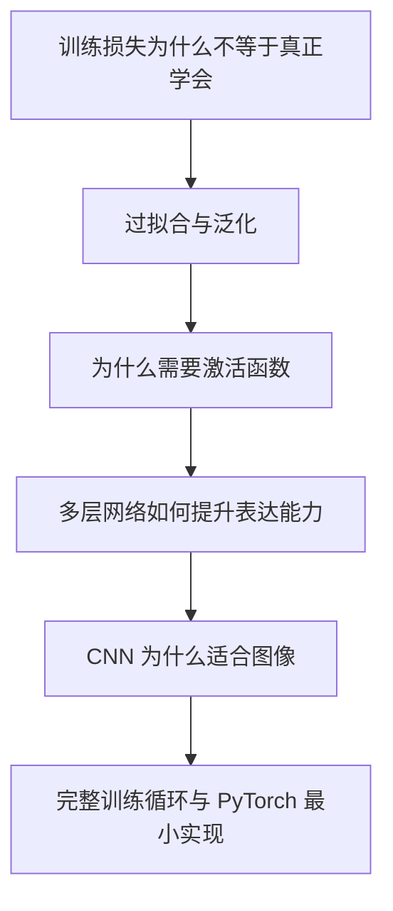

# 深度学习入门对话归档

## 基本信息

- 主题：用苏格拉底提问法入门深度学习（Deep Learning, DL）
- 方式：通过连续追问，从图像分类直觉逐步过渡到神经网络、损失函数、反向传播与优化
- 当前阶段：已建立最小直觉框架，尚未系统展开泛化（Generalization）、过拟合（Overfitting）、学习率（Learning Rate）与具体网络结构

## 本轮学习的核心目标

这轮对话的目标不是直接背定义，而是先回答几个更根本的问题：

1. 为什么人工设计特征在复杂感知任务里不够用？
2. 机器最开始“看到”图片时，究竟看到了什么？
3. 为什么深度学习强调“多层”而不是单层？
4. 神经网络中的参数究竟是什么，为什么能通过训练学出来？
5. 训练过程在数学上到底是在优化什么？
6. 反向传播（Backpropagation）为什么能帮助多层网络高效更新参数？

## 从人工规则到表示学习

### 1. 最朴素的出发点

入门问题从“如何判断图片里是猫还是狗”展开。最自然的直觉是先人工规定特征，例如：

- 嘴筒子长，可能是狗
- 舌头较长或明显伸出，可能是狗

这类思路本质上属于特征工程（Feature Engineering）：

- 先由人决定应该看哪些特征
- 再把特征翻译成规则
- 最后让程序据此分类

### 2. 人工特征的首个障碍

讨论中很快指出了人工规则的真正难点：

- 不是规则完全写不出来
- 而是图片中很多特征未必能稳定提取出来

例如：

- 图片角度不同
- 狗的嘴被遮挡
- 毛发太长
- 光照、分辨率、背景复杂

这意味着问题其实有两层：

1. 应该看什么特征？
2. 如何从原始图片中稳定提取这些特征？

传统方法更多依赖人工回答第一问，而深度学习试图让模型连“看什么”都一起学出来，这就是表示学习（Representation Learning）的核心直觉。

## 机器最开始看到的是什么

### 1. 不是“狗”，而是数字

关键认识：

- 对人类来说，图片里有“狗”
- 对机器来说，最开始只有数字

对于图像，这些数字通常来自像素（Pixel）。

### 2. 彩色图片如何表示

入门时容易把像素理解成“0 或 1”，但这只适用于非常简化的二值图像。现实里更常见的是 RGB 表示：

- `R`：红色（Red）
- `G`：绿色（Green）
- `B`：蓝色（Blue）

一个像素往往是 3 个数值的组合，例如：

```text
(255, 0, 0)
```

表示该位置红色强、绿色和蓝色弱，因此接近纯红。

所以一张彩色图片可以被理解为一个三维数字张量（Tensor）：

```text
高度 x 宽度 x 通道数
```

例如 `100 x 100 x 3`。

### 3. 从像素到概念之间缺少很多台阶

这一步带出了一个关键结论：

- 像素是低层、原始的数值表示
- “狗”是高层、抽象的语义概念
- 二者之间需要许多中间表示作为桥梁

## 为什么需要多层

### 1. 逐层组合的直觉

对话中形成的判断是：

- 更合理的方式不是让模型直接从像素一步跳到“狗”
- 而是先学出边缘、颜色块、纹理，再逐步组合成更复杂的形状

这就是深度学习中的分层特征表示（Hierarchical Feature Representation）直觉：

- 低层表示：边缘、方向、局部明暗变化
- 中层表示：纹理、局部形状、小部件
- 高层表示：耳朵、眼睛、嘴部轮廓、整体脸型
- 更高层表示：这是一只狗

### 2. “深度”是什么意思

“深度”并不只是网络很大，而更强调：

- 网络由多层（Layer）组成
- 每一层都在做一次表示变换（Representation Transformation）
- 越往后，表示通常越抽象

### 3. 单层模型的局限

对话中已经抓到关键直觉：

- 如果只有一层，模型很难直接从像素跳到高级概念

更一般地说，单层模型的问题在于：

- 缺少中间台阶
- 难以表达复杂组合关系
- 很难把局部模式逐层加工成语义概念

## 神经元与参数的最小直觉

### 1. 神经元可以先理解成模式探测器

一个最简单的神经元（Neuron）可以先直观地看成：

- 接收多个输入数字
- 对不同输入赋予不同重要性
- 做加权求和
- 再经过某种非线性变换或激活

因此它像一个“小型模式探测器”：

- 某种输入组合出现时，它就更容易激活
- 没有出现对应模式时，它反应较弱

### 2. 参数是什么

对话中逐渐明确：

- 每一层里有许多可学习参数（Parameters）
- 最主要的是权重（Weight）和偏置（Bias）

一个极简线性层可以写成：

```text
z = Wx + b
```

其中：

- `x` 是输入
- `W` 是权重矩阵
- `b` 是偏置
- `z` 是这一层的输出

训练时主要被更新的，就是这些 `W` 和 `b`。

## 训练在做什么

### 1. 从随机开始

一个关键理解已经建立起来：

- 参数通常不是人工指定
- 而是随机初始化后，通过训练不断调整

所以训练可以先粗略理解成：

- 一开始模型瞎猜
- 根据错误程度复盘
- 再把参数往更不容易错的方向改一点
- 重复很多次后，模型逐渐学会更合适的参数

### 2. 监督学习中的“正确答案”从哪里来

对“如何判断对错”这一问题，已经得到一个重要澄清：

- 在监督学习（Supervised Learning）里，不是每一步都有人实时介入
- 而是提前准备好带标签（Label）的数据集（Dataset）

例如：

- 输入是一张图片
- 标签是“猫”或“狗”

模型预测后，可以直接与标签比较，计算错误程度。

## 损失函数与优化目标

### 1. 损失函数在衡量什么

损失函数（Loss Function）用于回答：

- 当前预测和正确答案差多远？

如果：

- 预测正确且置信度高，损失较小
- 预测错误且很自信，损失较大

### 2. 深度学习的数学骨架

本轮对话已经抽象出深度学习的最小数学框架。

模型：

```text
y_hat = f(x; θ)
```

其中：

- `x`：输入
- `y_hat`：模型预测
- `f`：神经网络
- `θ`：所有可学习参数的集合

损失：

```text
L(y_hat, y)
```

其中：

- `y`：真实标签
- `L`：预测误差的度量

训练目标：

```text
min_θ L(f(x; θ), y)
```

更贴近数据集训练时，通常是最小化整个样本集合上的平均损失：

```text
min_θ (1/N) Σ L(f(x_i; θ), y_i)
```

### 3. 一个已经形成的正确抽象

对话中用户已经提出了非常关键的理解：

- 从本质上看，就是定义一个损失函数 `L`
- 它由输入数据、模型结构和大量参数共同决定
- 训练的目标就是调整这些参数，让 `L` 尽量小

这个理解基本正确，但需要补充两点：

- 不是所有出现在公式中的量都被优化，通常只优化参数 `θ`
- 输入 `x` 和标签 `y` 是给定数据，不是训练时被学习的对象

## 梯度下降与学习率

### 1. 为什么不能靠暴力搜索参数

讨论中明确提出：

- 网络里参数极多，不可能通过暴力遍历一个个试

因此需要一种高效方法判断：

- 某个参数增大一点会让损失变大还是变小
- 变化幅度大概多大

这就是梯度（Gradient）要回答的问题。

### 2. 梯度下降的直觉

梯度下降（Gradient Descent）可以直觉地理解为“摸坡下山”：

- 当前参数位置像站在地形上的某一点
- 地势高度对应损失大小
- 梯度告诉你当前最陡的上升方向
- 所以沿梯度反方向移动，就相当于朝下降更快的方向走

参数更新的常见形式是：

```text
θ <- θ - η * ∇_θ L
```

其中：

- `η`：学习率（Learning Rate）
- `∇_θ L`：损失对参数的梯度

### 3. 为什么每次只能改一点点

在这部分，对“更新不能太大”的直觉已经建立：

- 更新太大会跳过更好的位置
- 可能在最优点附近来回震荡
- 甚至让训练变得不稳定、损失升高

因此学习率控制的是：

- 每次沿梯度方向迈多大一步

太小：

- 学得很慢

太大：

- 训练可能发散或不收敛

## 反向传播到底在做什么

### 1. 不是“定位坏层”，而是计算影响

围绕“反向传播怎么知道哪一层有问题”的追问，已经澄清了一个重要误区：

- 反向传播不是简单地给某一层贴上“这里错了”的标签
- 它做的是计算每个参数对最终损失的敏感度

也就是：

```text
dL/dw
```

这表示：

- 某个参数 `w` 稍微变化一点时，最终损失 `L` 会如何变化

### 2. 为什么早期层也会影响最终结果

这里已经建立了清晰的因果链：

- 后面层的输入来自前面层的输出
- 如果前面层提取到的表示很差
- 后面的分类器即使再复杂，也是在“拿着脏材料继续加工”

因此：

- 离输出较远的早期层，同样会通过层层传递影响最终分类结果

### 3. 链式法则的直觉

反向传播（Backpropagation）的数学基础是链式法则（Chain Rule）。

朴素理解是：

- 如果 A 影响 B
- B 影响 C
- C 影响最终损失
- 那 A 也会间接影响最终损失

于是误差信号可以从输出层开始，一层层往回传，计算每个参数对最终损失的贡献方向和大小。

### 4. 前向传播与反向传播

当前已经形成的最小训练链路是：

1. 前向传播（Forward Pass）：输入图片，得到预测结果
2. 计算损失：比较预测与真实标签，算出错误程度
3. 反向传播：计算每个参数对损失的影响
4. 参数更新：按梯度反方向微调参数
5. 多轮重复：让损失逐渐下降

## 本轮已经建立的核心理解

经过这轮对话，已经建立起以下关键认知：

- 图像对机器来说首先是数值张量，而不是语义对象
- 人工设计特征的主要难点在于特征本身难以稳定提取
- 深度学习的价值之一是自动学习分层特征表示
- 多层网络之所以重要，是因为它提供了从低层模式到高层概念的中间台阶
- 神经网络本质上是一个带大量参数的复合函数
- 训练可以看成对参数进行优化，让损失函数尽量小
- 反向传播不是在“猜哪层错了”，而是在系统地计算每个参数对最终损失的影响

## 当前仍待继续探索的问题

本轮对话停在一个非常好的继续点上，后续建议围绕以下问题展开：

1. 为什么我们不能只盯着训练损失变小，而要关心模型到底学到了什么？
2. 模型“记住训练集”与“学会一般规律”之间的区别是什么？
3. 什么是过拟合（Overfitting）与泛化（Generalization）？
4. 激活函数（Activation Function）为什么必要？如果没有非线性会怎样？
5. 现实中的卷积神经网络（Convolutional Neural Network, CNN）是如何更高效地处理图像的？
6. 小批量梯度下降（Mini-Batch Gradient Descent）、优化器（Optimizer）和正则化（Regularization）分别在解决什么问题？

## 适合下一轮的学习顺序

建议下一轮继续沿着下面的顺序推进：



## 一句话总结

这轮入门已经把深度学习的最小框架搭起来了：

- 输入是数字
- 神经网络是带参数的分层函数
- 损失函数衡量预测错误
- 训练是在数据上优化参数，使损失下降
- 反向传播通过链式法则把最终错误分摊到每一个参数上

从这里继续往下学，最自然的下一步就是理解：

- 模型为什么不只是“把训练集背下来”
- 它为什么有时能学到可以迁移到新样本上的一般规律
