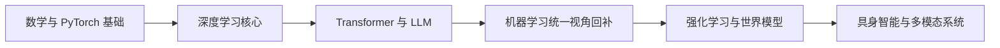

# 现代 AI 学习路线与 Transformer 核心问题归档

## 基本信息

- 主题：现代人工智能（Artificial Intelligence, AI）学习路线规划
- 重点方向：大语言模型（Large Language Model, LLM）、世界模型（World Model）、具身智能（Embodied Intelligence）
- 学习者背景：3-5 年后端开发经验，熟悉 AI 应用使用，但尚未系统理解底层原理
- 核心兴趣：数据为什么能够支撑智能、大模型为什么能通过“预测”实现对话与代码生成、Transformer 的精髓是什么

## 背景与学习目标

当前学习目标不是只会使用 AI 工具，而是逐步建立一套可迁移的理解框架，最终能够：

- 深入理解大模型、世界模型、具身智能的底层机制
- 形成从直觉、机制、数学到工程实现的完整认知链条
- 为未来进入相关科研方向或做出工程化突破打下基础

从提问方式可以看出，真正关心的不只是“怎么用模型”，而是：

1. 为什么数据本身看起来是“死的”，却能训练出具有智能感的系统？
2. 为什么通过“预测下一个 token”就能产生对话、问答和代码生成能力？
3. Transformer 与传统神经网络相比，究竟新在哪里？
4. 如果未来目标是世界模型与具身智能，应该如何规划主线学习路径？

## 一句话总结

- 最适合的学习主线是：数学与编程基础 -> 深度学习（Deep Learning, DL）-> Transformer -> 大语言模型 -> 强化学习（Reinforcement Learning, RL）与序列决策 -> 世界模型 -> 具身智能。
- 对当前背景而言，不建议先完整铺开传统机器学习（Machine Learning, ML）模型大全，而应先抓住现代 AI 的主发动机，即深度学习与 Transformer。
- “预测”之所以强大，不是因为它只是机械地猜下一个词，而是因为为了做好预测，模型被迫压缩数据中的统计结构、语义模式、知识关系与行为规律。

## 本次学习想回答什么问题

1. 为什么数据能够支撑出现代 AI 能力？
2. 预测学习为什么会产生看似“理解”与“推理”的效果？
3. Transformer 的自注意力（Self-Attention）到底解决了什么问题？
4. 它与传统神经网络、循环神经网络（Recurrent Neural Network, RNN）、卷积神经网络（Convolutional Neural Network, CNN）有什么本质区别？
5. 面向世界模型和具身智能，应该如何安排学习顺序？

## 核心理解框架

### 1. 现代 AI 的主问题是什么

从更抽象的角度看，现代 AI 试图解决的问题是：

“能否通过数据学习出一种内部表示，使系统可以在新情境下做出有用预测与决策？”

这里有三个关键词：

- 表示（Representation）：模型内部如何压缩外部世界的信息
- 预测（Prediction）：给定上下文，如何对未见部分做条件生成或判断
- 决策（Decision）：在有目标和反馈时，如何选择行动

大模型首先在语言和代码上把“表示 + 预测”做得极其成功；世界模型和具身智能则试图进一步把这种能力推进到“动态环境中的预测与行动”。

### 2. 为什么“死的数据”能产生能力

关键不在于数据是不是“死的”，而在于数据是否携带了现实世界的结构投影。

语言数据中隐含了：

- 人类对世界的描述方式
- 概念之间的关系
- 问题与回答的模式
- 程序代码的语法与调用习惯
- 常见任务的解决套路
- 人类在推理、解释和协作中的表达轨迹

训练的过程，本质上是在寻找一组参数，使模型能够用有限的表示容量去压缩这些结构。压缩得越有效，模型内部形成的表示就越有用。

因此可以把现代大模型理解为：

- 不是在“死记硬背数据”
- 而是在“提取数据中可泛化的结构”

### 3. 为什么“预测下一个 token”会产生对话能力

预测下一个 token 看似简单，但为了在真实语料中持续预测正确，模型必须隐式掌握很多东西：

- 当前话题是什么
- 上下文在问什么
- 哪些事实通常会一起出现
- 某类问题通常如何回答
- 一段代码下一行最可能遵循什么结构

所以 next-token prediction 的真正含义不是“猜字符”，而是：

“在给定上下文条件下，对未来信息做最合理的条件建模。”

当模型做这件事做得足够强时，对话、写作、问答、代码生成都会变成它的自然外显形式。

### 4. Transformer 的精髓是什么

如果要用一句话概括：

Transformer 的精髓是用注意力机制（Attention Mechanism）做内容寻址，让序列中的每个位置都能动态读取其他位置中对当前最有用的信息。

这件事之所以重要，是因为传统架构在信息交互上有明显限制：

- 多层感知机（Multi-Layer Perceptron, MLP）主要做固定层间变换，缺乏灵活的跨位置交互
- RNN 依赖链式传递，长距离依赖难学，训练难并行
- CNN 强于局部模式提取，但不天然适合建模任意远的依赖关系

Transformer 通过自注意力，让每个 token 都可以“看向全局”，并按内容相关性加权整合信息，因此在序列建模上取得了决定性优势。

## Transformer 的关键机制拆解

### 自注意力在做什么

对每个位置的表示，模型会生成三类向量：

- Query：我现在想找什么信息
- Key：我这里有什么可被匹配的信息
- Value：如果你关注我，你应该读走什么内容

一个位置的 Query 与其他位置的 Key 做相似度计算，得到注意力分数；经过缩放和 softmax 后，形成对所有位置的权重；再用这些权重对对应的 Value 做加权求和。

直觉上，这相当于：

- 当前 token 发出检索请求
- 全文其他 token 提供可匹配线索
- 模型按相关程度读取信息并更新当前表示

### 多头注意力为什么有用

单一注意力头往往只能学到一种相关性模式。

多头注意力（Multi-Head Attention）允许模型在不同子空间中并行关注不同关系，例如：

- 语法依赖
- 指代关系
- 主题一致性
- 代码作用域
- 局部搭配与全局结构

这使模型能同时从多个视角理解上下文。

### 为什么还需要前馈网络

注意力负责“从哪里读信息”，前馈网络（Feed-Forward Network, FFN）负责“如何在当前位置上进一步非线性变换与加工信息”。

如果只有注意力，模型擅长交互但局部变换能力不足；如果只有 FFN，模型能变换但难以灵活读取上下文。两者结合，才构成 Transformer Block 的基本能力。

### 残差连接和层归一化的作用

- 残差连接（Residual Connection）帮助信息与梯度稳定传播
- 层归一化（Layer Normalization）帮助训练过程更稳定

它们并不是主角，但没有这些工程机制，大模型往往难以高效训练。

### 因果掩码为什么能做生成

在语言建模中，模型训练时不能偷看未来 token，因此使用因果掩码（Causal Mask）约束每个位置只能访问自己之前的内容。

这样模型学到的是：

- 给定前文，预测后文

推理时再按这个规则一步步生成，就自然形成了文本续写、对话和代码补全能力。

## 数学层的最小理解

### 1. 学习在优化什么

训练时，模型会最小化某种损失函数（Loss Function）。在语言模型中，核心目标可以理解为：

- 让正确下一个 token 的概率尽可能高
- 让错误 token 的概率尽可能低

常见形式是交叉熵损失（Cross-Entropy Loss），它本质上来源于最大似然估计（Maximum Likelihood Estimation, MLE）。

### 2. 为什么这和“压缩”有关

如果一个模型能够很好地预测数据，就说明它抓住了数据中的规律；如果完全抓不住规律，预测就会接近随机。

从信息论视角看：

- 越可预测，说明越能用更少的不确定性描述数据
- 越能压缩数据中的结构，说明内部表示越贴近真实模式

这也是为什么“预测”与“世界结构建模”之间存在深层联系。

### 3. 反向传播在做什么

反向传播（Backpropagation）并不是魔法，它只是链式法则（Chain Rule）在复合函数上的系统化应用。

它回答的问题是：

“当前预测错了以后，网络中每个参数该往哪个方向改、改多少，才能让整体损失下降？”

如果不理解反向传播，后面就很难真正理解大模型训练为什么成立。

## 与传统机器学习和传统神经网络的区别

| 维度 | 传统机器学习 | 传统神经网络 / RNN / CNN | Transformer / LLM |
| --- | --- | --- | --- |
| 特征来源 | 人工特征为主 | 部分自动学习 | 大规模自动表示学习 |
| 信息交互方式 | 较固定 | 链式或局部交互 | 全局、动态、按内容选择 |
| 长距离依赖 | 通常不擅长 | RNN 较难，CNN 不天然 | 自注意力更直接 |
| 并行训练 | 视模型而定 | RNN 较差 | 很强 |
| 扩展性 | 有限 | 中等 | 极强，适合大规模预训练 |
| 典型能力 | 分类回归、结构化任务 | 视觉、序列建模基础任务 | 对话、生成、代码、多模态基础底座 |

一个关键结论是：

现代大模型的突破，不只是参数更多，而是信息交互结构、训练规模、自监督目标和工程扩展性共同变化的结果。

## 推荐学习路线

### 阶段 1：数学与编程最小基础

目标是先建立“能读懂深度学习训练过程”的最低门槛。

应优先掌握：

- 线性代数：向量、矩阵乘法、线性变换
- 概率统计：条件概率、期望、方差、最大似然
- 微积分：偏导数、梯度、链式法则
- Python 科学计算：`numpy`、`matplotlib`
- PyTorch 基础：张量、自动求导、模块、训练循环

### 阶段 2：深度学习主线

这是最应该先进入的部分，而不是先把传统机器学习完整学一遍。

应重点掌握：

- 感知机与多层感知机
- 激活函数为什么需要非线性
- 损失函数与优化器
- 反向传播
- 过拟合、欠拟合、正则化
- 表示学习（Representation Learning）

阶段目标是能真正回答：

- 神经网络为什么能拟合复杂模式？
- 梯度下降为什么有效？
- 深层表示为什么比人工特征更强？

### 阶段 3：Transformer 与大语言模型

这是现代 AI 学习的主战场。

应重点掌握：

- Embedding 与位置编码（Positional Encoding）
- Self-Attention、Multi-Head Attention
- FFN、Residual、LayerNorm
- Causal Mask
- 预训练（Pretraining）
- 指令微调（Supervised Fine-Tuning, SFT）
- 偏好优化与对齐
- 推理与采样：温度、top-k、KV Cache

阶段目标是能解释：

- 为什么 Transformer 比 RNN 更适合做大模型
- 为什么 next-token prediction 能学出语义能力
- 大模型为什么会出现上下文学习（In-Context Learning）现象

### 阶段 4：补机器学习统一视角

这一步是回补，不是起点。

建议补齐：

- 偏差-方差权衡
- 泛化（Generalization）
- 经验风险最小化
- 正则化
- 线性模型、树模型的归纳偏置

目的不是转向传统 ML，而是建立更统一的“学习理论感”。

### 阶段 5：强化学习与世界模型

如果未来要进入世界模型与具身智能，这一阶段是必要桥梁。

应重点掌握：

- 马尔可夫决策过程（Markov Decision Process, MDP）
- 状态、动作、奖励、策略、价值函数
- Model-Free 与 Model-Based RL
- 规划（Planning）
- 潜变量模型（Latent Variable Model）
- 序列建模、视频预测、环境建模

世界模型的核心思想可以概括为：

- 学到一个内部环境模型
- 在内部预测未来演化
- 用预测支持行动选择与规划

### 阶段 6：具身智能

具身智能要求把多个模块真正打通：

- 感知：视觉、语言、触觉等多模态输入
- 表示：状态如何压缩与抽象
- 决策：下一步做什么
- 控制：动作如何稳定执行
- 世界模型：行动后环境会怎么变化

此阶段通常还需要补：

- 机器人学基础
- 控制理论基础
- 计算机视觉
- 仿真平台与 sim-to-real 问题

## 建议的阶段顺序

## 为什么建议“先深度学习，再补机器学习”

对当前背景而言，这样安排更高效，原因有三点：

- 你的核心兴趣集中在现代大模型与生成能力，而不是传统结构化预测任务
- 深度学习是理解 Transformer、LLM、世界模型的直接前置知识
- 传统机器学习中的很多概念，可以在学过深度学习之后更快建立统一理解

换句话说，机器学习基础当然重要，但不必把它当作进入现代 AI 的唯一大门。

## 一个适合当前背景的 6-8 个月主线

- 第 1 个月：数学最小集、PyTorch、MLP 基础
- 第 2 个月：反向传播、优化、正则化、表示学习
- 第 3-4 个月：Transformer 全流程与 mini-GPT
- 第 5 个月：LLM 训练链路，从 pretrain 到 SFT/偏好优化
- 第 6-7 个月：强化学习基础与世界模型入门
- 第 8 个月以后：具身智能、多模态、论文复现与工程实践

## 建议的学习产出

为了避免只停留在“看懂”，建议每个阶段都产出具体成果：

- 学完 MLP：手写一个二分类和一个回归训练脚本
- 学完反向传播：写出自己的公式推导笔记
- 学完 Transformer：从零实现一个 mini-GPT
- 学完 LLM：画出 `pretrain -> SFT -> preference optimization` 的训练链路
- 学完 RL：实现一个最小 Q-learning 或 policy gradient 例子
- 学完世界模型：整理“观测、潜状态、动作、预测、规划”的闭环图

## 常见误区

### 误区一：先把所有传统机器学习学完，再开始大模型

不必。对现代 AI 主线而言，更高效的方式通常是先建立深度学习直觉，再回补 ML 统一视角。

### 误区二：大模型只是参数变多了

不对。真正关键的是注意力结构、自监督目标、训练规模、数据分布、优化机制和工程扩展性的共同作用。

### 误区三：预测只是低级任务，不可能导出高级能力

不对。高质量预测要求模型掌握大量潜在结构，因此预测可以成为通往语义、知识和规划雏形的通用入口。

### 误区四：世界模型和大语言模型完全无关

不对。两者都依赖表示学习与序列预测，只是世界模型更强调行动、状态演化和环境动态。

## 值得持续追问的问题

1. 预测目标为什么能逼出可泛化表示？
2. Transformer 学到的究竟是统计共现，还是某种更抽象的结构？
3. 大模型的“推理”有多少来自真正的内部计算过程，有多少来自模式匹配？
4. 世界模型与语言模型能否共享统一的架构与训练目标？
5. 具身智能是否需要超越纯 token 预测的学习范式？

## 后续学习建议

- 优先沿着“深度学习 -> Transformer -> LLM”主线推进
- 每学一个模块，都从“问题、机制、数学、工程、局限”五个角度做笔记
- 不要只追热点论文，先把经典主线真正吃透
- 通过最小实现建立直觉，而不是只看概念介绍
- 在进入世界模型和具身智能前，先把序列建模、表示学习和强化学习基础打牢

## 本次归档结论

- 当前最合适的起点是深度学习，而不是完整传统机器学习路线
- 真正需要尽快吃透的是反向传播、表示学习、注意力机制与 Transformer
- “预测”之所以有效，是因为它迫使模型压缩并利用数据中的深层结构
- Transformer 的关键突破在于全局、动态、按内容选择的信息交互方式
- 世界模型和具身智能不是独立孤岛，而是建立在表示学习、预测与决策统一框架之上的延伸方向
